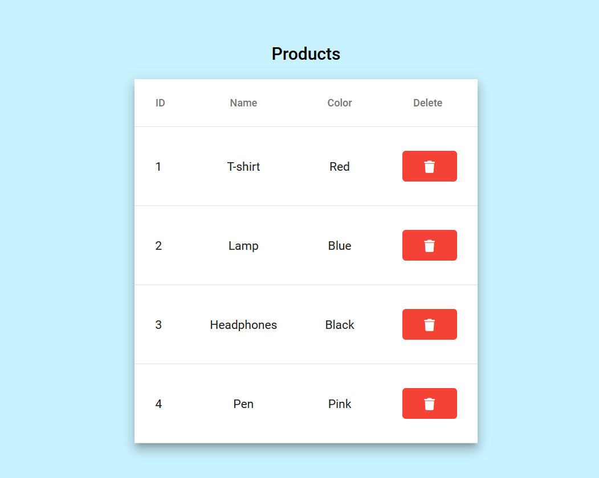
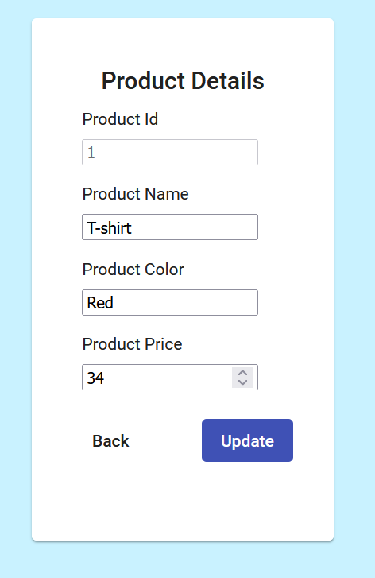
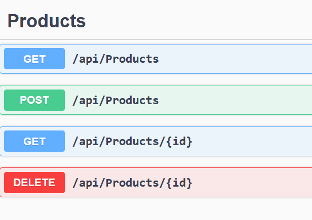

# NET_Angular_CRUD_App
Full-stack CRUD app using ASAP.NET Core and Angular

# Back-end
ASAP.NET Core 6 web API, Used [Entity Framework Core In-Memory database](https://docs.microsoft.com/en-us/ef/core/providers/in-memory/?tabs=dotnet-core-cli)

Backend files located in NET_Angular_CRUD_App/API/Products/
## Run App
Run app using Microsoft Visual Studio  

or

.Net CLI:

`cd ../NET_Angular_CRUD_App/API/Products/`

`dotnet watch run`

## Available Methods
https://localhost:7115/swagger

# Front-end

This project UI was generated with [Angular CLI](https://github.com/angular/angular-cli) version 12.0.0.

To exectue the following commands first `cd ../NET_Angular_CRUD_App/UI/Products/`
## Development server

Run `ng serve` for a dev server. Navigate to `http://localhost:4200/`. The app will automatically reload if you change any of the source files.

## Code scaffolding

Run `ng generate component component-name` to generate a new component. You can also use `ng generate directive|pipe|service|class|guard|interface|enum|module`.

## Build

Run `ng build` to build the project. The build artifacts will be stored in the `dist/` directory. Use the `--prod` flag for a production build.

## Further help

To get more help on the Angular CLI use `ng help` or go check out the [Angular CLI Overview and Command Reference](https://angular.io/cli) page.
