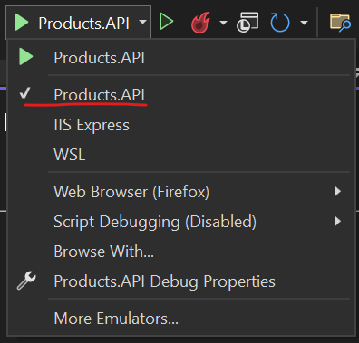

# ASAP.NET Core & Angular CRUD Web App
Full-stack CRUD app using ASAP.NET Core and Angular

# Back-end
ASAP.NET Core 6 web API, Used [Entity Framework Core In-Memory database](https://docs.microsoft.com/en-us/ef/core/providers/in-memory/?tabs=dotnet-core-cli)

Backend files located in `NET_Angular_CRUD_App/API/Products/`

## Install packages 
Please make sure you have nuget.org enlisted as a package source (Microsoft Visual Studio), if not, [add package source](https://docs.microsoft.com/en-us/nuget/consume-packages/install-use-packages-visual-studio#package-sources) [Name: nuget.org, Source: https://api.nuget.org/v3/index.json]
## Run App
Run app using [Microsoft Visual Studio](https://docs.microsoft.com/en-us/visualstudio/get-started/csharp/tutorial-aspnet-core?view=vs-2022#run-debug-and-make-changes-1) by clicking on run button 

or

.Net CLI:

`cd ../NET_Angular_CRUD_App/API/Products/`

`dotnet watch run`

## Available Methods
https://localhost:7115/swagger

# Front-end

This project UI was generated with [Angular CLI](https://github.com/angular/angular-cli) version 12.0.0.

To exectue the following commands first `cd ../NET_Angular_CRUD_App/UI/Products/`

## Installl npm modules

If you don't have Angular-Cli run `npm install -g @angular/cli@12.0.0` 

Run `npm install` to install all required modules

## Development server

Run `ng serve` for a dev server. Navigate to `http://localhost:4200/`. The app will automatically reload if you change any of the source files.
## Build

Run `ng build` to build the project. The build artifacts will be stored in the `dist/` directory. Use the `--prod` flag for a production build.

## Further help

To get more help on the Angular CLI use `ng help` or go check out the [Angular CLI Overview and Command Reference](https://angular.io/cli) page.
